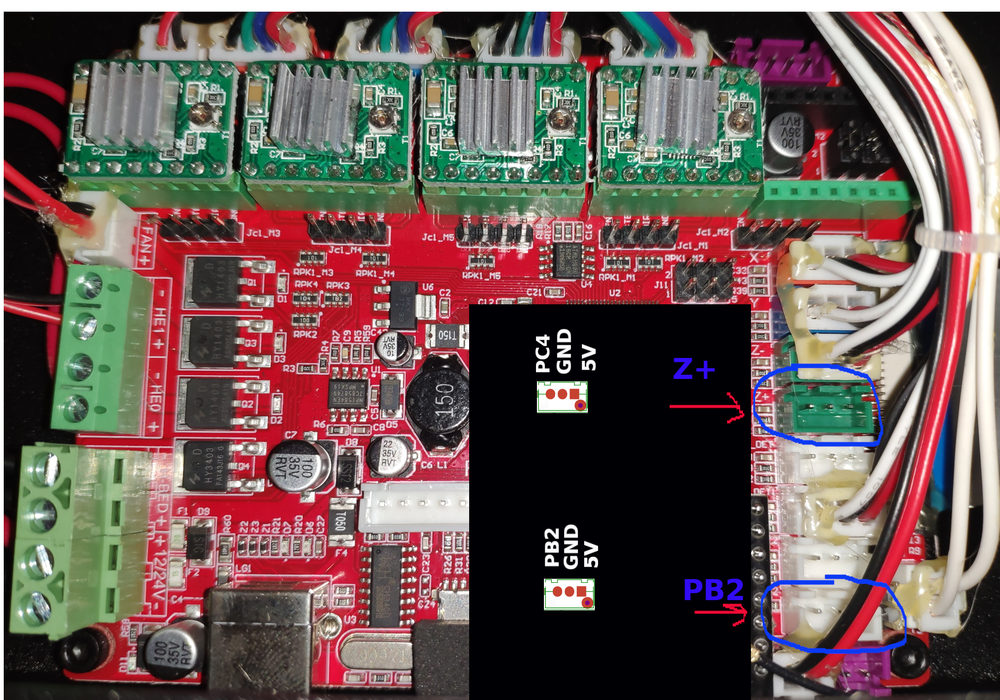

# Подключение датчика BLTouch к robin nano v1.1

Датчик BLtouch используется для построения карты высот стола. Общую информацию о работе и подключении можно посмотреть в видео:

* Дмитрий Соркин, [BLTouch. Стоит ли покупать? Установка, прошивка](https://www.youtube.com/watch?v=oJgKQKbN8nE)
* Бессистемный техноблог [Краткий рассказ о подключении датчика уровня стола BLTouch или его китайского аналога 3DTouch к плате MKS Robin Nano](https://www.youtube.com/watch?v=39TEYQN8iQ4)
* Sergey Irbis [Сравнение BLTouch и 3DTouch, тесты с кривым столом.](https://www.youtube.com/watch?v=x8OQZP-a3kc)

## Датчик

[BLTouch](https://aliexpress.ru/item/32832887426.html) от Trianglelab. В комплекте с датчиком идут провода, но их длины не хватает для подключения к плате на FB4S. Для удлинения проводов можно использовать еще один комплект [удлинителя](https://aliexpress.ru/item/32842916585.html)

Для надежного подключения к плате можно использовать JST XH 2.54 3 Pin коннектор.

## Установка датчика

Я устанавливал датчик на [универсальную голову](https://www.thingiverse.com/thing:4394165)

Для установки датчика, нужны [небольшие изменения](https://www.thingiverse.com/thing:4568900)

## Подключение

У датчика 5 проводов, которые можно разделить на две группы: управление щупом (серва) и концевик. Обычно провода обозначаются цветом.

Управление щупом:

* Коричневый - GND
* Красный - 5V
* Оранжевый - сигнал управления

Концевик:

* Черный - GND
* Белый - сигнал

Для парковки стола по высоте можно использовать как штатный концевик, так и щуп BLTouch. В данном случае, используется штатный концевик, поэтому щуп BLTouch подключен в разъем ZMax (пин PC4). Это позволяет использовать одну и ту же прошивку как с датчиком, так и без него.

Управление выдвиганием щупа подключено в разъем PB2 (так же обозначен на плате).

Выбор ног для подключения может быть произвольным, однако надо учитывать, что на плате Robin Nano разъемы ZMin, Zmax, PWR-DET, MT1-DET, MT2-DET выполненый как вход. Выражается это в схемотехнике на плате:


Резисторы R32 - R37 номиналом 10К. Это позволяет подключать к этим разъемам устройства с уровнем в 5V. В том числе и BLTouch.

Разъем PB2 выполнен как выход, с токоограничивающим резистором R38 номинало 100 Ом.

На плате разъемы расположены следующим образом:



## Настройка Marlin

В сборке [под FB4S](https://github.com/Sergey1560/Marlin_FB4S) основные настройки уже сделаны и достаточно просто подключить датчик.

Основные настройки:

Marlin/src/pins/stm32f1/pins_MKS_ROBIN_NANO.h

```
#define SERVO0_PIN                          PB2
#define BL_TOUCH_Z_PIN                      PC4
```

Файл Marlin/Configuration.h, секция "Z Probe Options" (примерно 855 строка).

Поскольку используется парковка по концевику, а не по BLtouch, то следующие опции выключены:

```
//#define Z_MIN_PROBE_USES_Z_MIN_ENDSTOP_PIN

// Force the use of the probe for Z-axis homing
//#define USE_PROBE_FOR_Z_HOMING
```

Нога щупа BLtouch:
```
#define Z_MIN_PROBE_PIN BL_TOUCH_Z_PIN // Pin 32 is the RAMPS default
```

Отключить ручной режим, включить BLTouch

```
//#define PROBE_MANUALLY
#define BLTOUCH
```

Смещение сопла относительно датчика:
```
#define NOZZLE_TO_PROBE_OFFSET { 37, -20, 0 }
```

Перед началом калибровки уровня стола нужно выставить его приблизительно ровно. Так же стоит проверить корректность установки BLTouch по высоте - его щуп должен "защелкиваться" раньше, чем сопло коснется стола.

Перед настройкой, рекомендую посмотреть [видео](https://www.youtube.com/watch?v=oJgKQKbN8nE) Дмитрия Соркина, чтобы представлять весь процесс. Порядок настройки:

* Сбросить Z PROBE OFFSET в 0. Это можно сделать или командой [M851 Z0](https://marlinfw.org/docs/gcode/M851.html) или из меню принтера.
* Запустить измерение высот командой [G29](https://marlinfw.org/docs/gcode/G029.html)
* Передвинуть голову примерно в центр стола и опустить голову в 0 по Z. Удобнее всего это сделать при помощи G-code

```
G1 X120 Y120 F4000 ;передвинуть голову в центр стола
G1 Z0 F500 ;опустить Z в 0
G91 ;Переключить в относительные координаты
```

Дальше нужно подложить лист бумаги и примерно выставить высоту командами "G1 ZN" выставить нужный зазор. Подробнее об этом в [видео](https://www.youtube.com/watch?v=oJgKQKbN8nE) Дмитрия Соркина. Особая точность в этом месте не нужна, достаточно, чтобы сопло не цепляло стол.

Команда [M114](https://marlinfw.org/docs/gcode/M114.html) выводит текущие координаты. Значение Z PROBE OFFSET можно установить командой M851, или из меню принтера.

На данном этапе, лучше сохранить построенную карту высот командой M500 или "Store Settings" из меню принтера.

Первоначальная, грубая калибровка на этом закончена. Для точной установки высоты сопла нужно запустить печать какой-нибудь небольшой модели, установив тип прилегания в "юбка" с большим количеством линий. Например обычный калибровочный кубик, и 30 линий юбки.

Во время печати юбки, по тому как ложаться линии видно, куда нужно двигать сопло. Не останавливая печать, в меню Tune -> Baby Stepping изменяем высоту, контролируя результат на столе. Когда результат устроит, нужно запомнить значение Baby Stepping и можно остановить печать. Значение Baby Stepping нужно добавить к Z PROBE OFFSET и сохранить настройки "Store settings".

## Использование датчика

Строить карту высот можно либо перед каждой печатью, добавив G29 в стартовый код, либо выполнить калибровку и сохранить ее в eeprom памяти ("Store settings"). При частой печати небольших моделей, целесообразно не тратить время перед каждой печатью на калибровку, а сделать ее один раз и сохранить в памяти. Если основная печать это большие модели, можно добавить калибровку в стартовый код.
