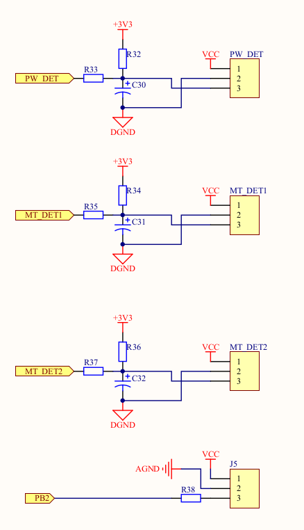
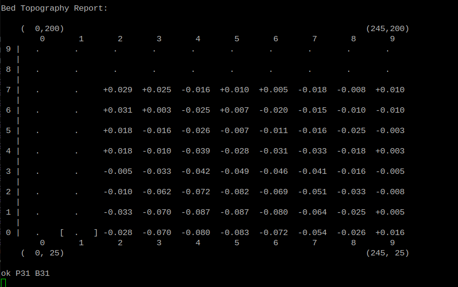
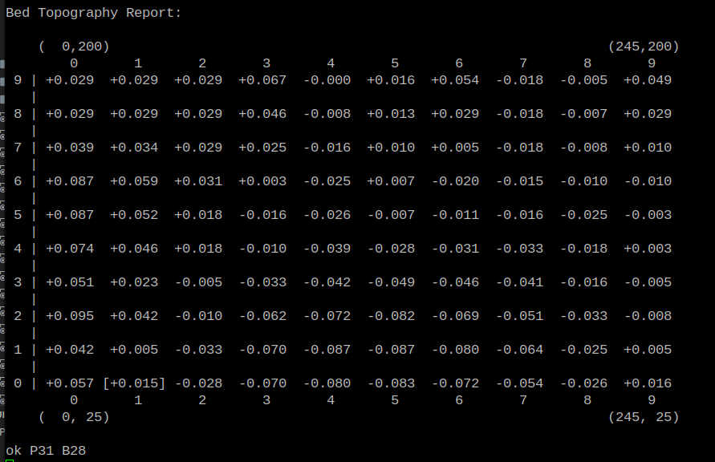
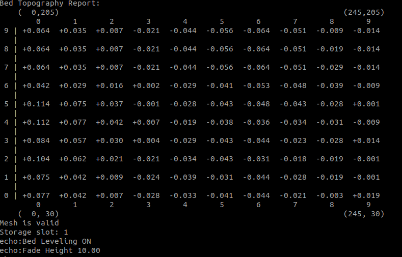

# Подключение датчика BLTouch к robin nano v1.1

Датчик BLtouch используется для построения карты высот стола. Общую информацию о работе и подключении можно посмотреть в видео:

* Дмитрий Соркин, [BLTouch. Стоит ли покупать? Установка, прошивка](https://www.youtube.com/watch?v=oJgKQKbN8nE)
* Бессистемный техноблог [Краткий рассказ о подключении датчика уровня стола BLTouch или его китайского аналога 3DTouch к плате MKS Robin Nano](https://www.youtube.com/watch?v=39TEYQN8iQ4)
* Sergey Irbis [Сравнение BLTouch и 3DTouch, тесты с кривым столом.](https://www.youtube.com/watch?v=x8OQZP-a3kc)

## Датчик

[BLTouch](https://aliexpress.ru/item/32832887426.html) от Trianglelab. В комплекте с датчиком идут провода, но их длины не хватает для подключения к плате на FB4S. Для удлинения проводов можно использовать еще один комплект [удлинителя](https://aliexpress.ru/item/32842916585.html)

Для надежного подключения к плате можно использовать JST XH 2.54 3 Pin коннектор.

## Установка датчика

Для установки датчика на [универсальную голову для FB4S](https://www.thingiverse.com/thing:4394165) нужны [небольшие изменения](https://www.thingiverse.com/thing:4568900)

Для установки на другую голову, необходимо сделать кронштейн для датчика. Основные требования:

* В убранном состоянии щуп должен быть выше сопла
* В выдвинутом состоянии щуп должен быть ниже сопла
* Положение щупа, в котором срабатывает концевик, должно быть ниже сопла

## Подключение

У датчика 5 проводов, которые можно разделить на две группы: управление щупом (серва) и концевик. Обычно провода обозначаются цветом.

Управление щупом:

* Коричневый - GND
* Красный - 5V
* Оранжевый - сигнал управления

Концевик:

* Черный - GND
* Белый - сигнал

Для более прогнозируемой и понятной работы Bltouch парковку оси Z следует сделать по датчику, а не по концевику. В данном случае, чтобы не вносить лишних изменений и оставить возможность отключить Bltouch только прошивкой, не изменяя подключения проводов, датчик подключен в разъем ZMax (пин PC4).

Управление выдвиганием щупа подключено в разъем PB2 (так же обозначен на плате).

Выбор ног для подключения может быть произвольным, однако надо учитывать, что на плате Robin Nano разъемы ZMin, Zmax, PWR-DET, MT1-DET, MT2-DET выполненый как вход. Выражается это в схемотехнике на плате:



Резисторы R32 - R37 номиналом 10К. Это позволяет подключать к этим разъемам устройства с уровнем в 5V. В том числе и BLTouch.

Разъем PB2 выполнен как выход, с токоограничивающим резистором R38 номинало 100 Ом.

На плате разъемы расположены следующим образом:


## Настройка Marlin

Настройки приведены для сборки [под FB4S](https://github.com/Sergey1560/Marlin_FB4S).

Основные настройки:

Marlin/src/pins/stm32f1/pins_MKS_ROBIN_NANO.h

```
#define SERVO0_PIN                          PB2
#define BL_TOUCH_Z_PIN                      PC4
```

Файл Marlin/Configuration.h, секция "Z Probe Options".

Поскольку используется парковка по BLtouch, а не по концевику, то нужно включить:

```
// Force the use of the probe for Z-axis homing
#define USE_PROBE_FOR_Z_HOMING
```

Нога щупа BLtouch:

```
#define Z_MIN_PROBE_PIN BL_TOUCH_Z_PIN // Pin 32 is the RAMPS default
```

Отключить ручной режим, включить BLTouch

```
//#define PROBE_MANUALLY
#define BLTOUCH
```

Смещение сопла относительно датчика:

```
#define NOZZLE_TO_PROBE_OFFSET { 37, -20, 0 }
```

Измерять 3 раза и выпадающее значение отбрасывать:

```
#define MULTIPLE_PROBING 3
#define EXTRA_PROBING    1
```

Предел для установки Z Offset:

```
#define Z_PROBE_OFFSET_RANGE_MIN -3
#define Z_PROBE_OFFSET_RANGE_MAX 3
```

Включение теста точности датчика:

```
#define Z_MIN_PROBE_REPEATABILITY_TEST
```

Задать способ построения сетки:

```
#define AUTO_BED_LEVELING_UBL
```

Включить Z_SAFE_HOMING и задать точку для парковки:

```
#define Z_SAFE_HOMING
#if ENABLED(Z_SAFE_HOMING)
  #define Z_SAFE_HOMING_X_POINT (37)    // X point for Z homing when homing all axes (G28).
  #define Z_SAFE_HOMING_Y_POINT (5)    // Y point for Z homing when homing all axes (G28).
#endif
```

Для Z_SAFE_HOMING_X_POINT и Z_SAFE_HOMING_Y_POINT указывается точка по положению щупа, а не сопла. В данном случае, голова займет положение, в котором щуп датчика находится в X37 Y5. Учитывая настройку PROBE_OFFSET, положение сопла по оси X окажется Z_SAFE_HOMING_X_POINT - PROBE_OFFSET_X = 37 - 37 = 0. По оси Y: Z_SAFE_HOMING_Y_POINT - PROBE_OFFSET_Y = 5 - (-20) = 25

### Задание границ для замеров

Можно задать отступы и границы, куда может дотянуться щуп датчика. При парковке головы по концевикам осей X и Y на FB4S сопло оказывается вне пределов стола по оси Y. По оси X сопло не может достигнуть край стола, в моем случае оно смещено на 13мм. Для упрощения расчетов, я применил коррекцию только по оси Y:

```
// The size of the print bed
#define X_BED_SIZE 245
#define Y_BED_SIZE 200

// Travel limits (mm) after homing, corresponding to endstop positions.
#define X_MIN_POS 0
#define Y_MIN_POS -6
#define Z_MIN_POS 0
#define X_MAX_POS X_BED_SIZE+X_MIN_POS
#define Y_MAX_POS Y_BED_SIZE
#define Z_MAX_POS 200

```

Исходят из этих настроек, точка 0,0 для сопла будет совпадать с позицией концевика по оси X, и на 6мм сдвинута по оси Y.

В моем случае, никаких дополнительных ограничений по перемещению датчика нет:

```
#define PROBING_MARGIN_LEFT PROBING_MARGIN
#define PROBING_MARGIN_RIGHT PROBING_MARGIN
#define PROBING_MARGIN_FRONT PROBING_MARGIN
#define PROBING_MARGIN_BACK PROBING_MARGIN
```

Границы сетки считаются по положению сопла. Для того, чтобы щуп датчика не промахивался мимо стола, сетка сдвинута на 25мм по Y. Учитывая, что в Y_MIN_POS стоит реальное смещение сопла от края стола и в точке Y0 сопло оказывается на краю стола, занчение MESH_MIN_Y расчитано из PROBE_OFFET_Y (20 мм) + небольшой зазор в 5мм от края.

```
#define MESH_MIN_X 0
#define MESH_MIN_Y 25
#define MESH_MAX_X X_MAX_POS
#define MESH_MAX_Y Y_MAX_POS
```

### Порядок настройки датчика

* Сбросить настройки прошивки и сохранить eeprom. Это можно сделать командами:

```
M502 ;factory reset
M500 ;save
```

Или из меню принтера, "initialize eeprom".

* Проверить работоспособность датчика в меню Bltouch. По команде "deploy" щуп должен опускаться, по команде "stow" подниматься. При этом в выводе команды [M119](https://marlinfw.org/docs/gcode/M119.html) должно меняться состояние для z_probe.
* Сбросить Z PROBE OFFSET в 0. Это можно сделать или командой [M851 Z0](https://marlinfw.org/docs/gcode/M851.html) или из меню принтера.
* Выполнить команду [G28](https://marlinfw.org/docs/gcode/G028.html) или Auto Home из меню. Первый раз, желательно подстраховаться, чтобы в случае если датчик не работает, не упереться соплом в стол: предварительно опустить стол вниз и во время парковки оси Z рукой нажать на щуп датчика. Замер происходит несколько раз.
* Предварительно определить Z PROBE OFFSET. Для этого сначала нужно выполнить парковку командой [G28](https://marlinfw.org/docs/gcode/G028.html) или Auto Home из меню. По умолчанию, после парковки, стол опускается на 10мм. Отправляем стол в точку 0, или командой G1 Z0 или из меню движения. Если датчик установлен правильно, между соплом и столом будет какое-то расстояние. Кладем лист бумаги и небольшими шагами начинаем приближать стол к соплу. Большая точность не нужна, достаточно просто чтобы лист слегка закусывало, но он не был прижат. Текущую координату по Z можно посмотреть на экране или командой [M114](https://marlinfw.org/docs/gcode/M114.html). Полученное значение со знаком минус нужно указать в Z PROBE OFFSET.
* Выровнять стол. Для лучше геометрии моделей можно выровнять плоскость стола параллельно плоскости движения головы. Для этого нужно выбрать 4 точки по краям стола. В моем случае это точки с координатами (0,25), (208,25), (208,200), (0,200). Максимальнальная координата по Y, в моем случае, ограничена перемещением головы, т.к. датчик стоит перед соплом (значение в PROBE_OFFSET 20). По X максимальное значение определяется так: максимальное перемещение по X (245 в моем случае) + занчение PROBE_OFFSET по X (-37).
Отправляем голову в точку (удобно уделть это командой [G1](https://marlinfw.org/docs/gcode/G000-G001.html), например "G1 X208 Y25"), и запускаем команду [G30](https://marlinfw.org/docs/gcode/G030.html). Будет измерена высота в данной точке. Подкручивая винты, можно выставить стол, чтобы значения во всех 4 точках были одинаковые.
* Построить сетку поверхности стола:

```
M190 S80 ;нагреть стол до 80 градусов
G29 P0   ;обнулить текущую сетку
G29 P1 T ;запустить измерение, выводить резульаты
```

Начнется измерение высоты в точках, куда возможно дотянуться щупом. В моем случае, для сетки из 100 точек (100*100) щуп смог дотянуться до 64. Посмотреть результат измерения можно или командой "G29 T" или "M420 V". После замера ответ выглядит приблизительно так:


Для использования сетки, остальные значения нужно рассчитать. Делается это командой:

```
G29 P3 T
```

Эта команда, заполняет "один шаг" в сетке, поэтому для заполнения сетки полностью, ее нужно выполнить несоклько раз. Между запусками, можно посмотреть результат командой "G29 T". В моем случае, запустить команду нужно было дважды. В результате получилась полная сетка поверхности:



Теперь результат можно сохранить. Есть возможность сохранить несколько сеток.

```
G29 S1     ;сохранить сетку под номером 1
G29 F 10.0 ;установить Fade Height
G29 A      ;сохранить сетку в eeprom.
M500       ;записать eeprom
```

Fade Height - это высота в мм после которой не будет применяться коррекция.

* Проверить, что настройки сохранены: перезагрузить принтер и посмотреть состояние:

```
M420 V
```



В выводе команды должна быть сетка с актуальными значениями, состояние "Mesh is valid", а так же "Bed Leveling ON"

* В процессе эксплуатации стол может немного изменить свое положение. Для быстрой коррекции, в стартовый код можно добавить команду быстрой коррекции наклона стола по 3-м точкам. Для того, чтобы корреция происходила после нагрева стола, но до нагрева сопла, нужно добавить макросы. Для Cura:

```
G28   ;парковка, чтобы обнулить координаты
G29 J ;Запустить коррекцию наклона стола
G28   ;вернуть голову в нулевую позицию

M104 S{material_print_temperature_layer_0} 
M109 S{material_print_temperature_layer_0}
```

Для Prusaslicer/SuperSlicer:

```
G28   ;парковка, чтобы обнулить координаты
G29 J ;Запустить коррекцию наклона стола
G28   ;вернуть голову в нулевую позицию
```

* Запустить пробную печать небольшой модели с большим количеством линий юбки. Тестовый кубик с 30 линиями юбки отлично подойдет.
* Во время печати юбки из меню Tune-> [BabyStepping](https://marlinfw.org/docs/gcode/M290.html) изменяя высоту стола добиться правильной укладки линий. BabyStepping это возможность изменять высоту стола небольшими шагами (по умолчанию по 0.01 мм). Эти изменения не влияют на расчеты и никак не учитываются прошивкой, это просто возможность "подвигать" мотор оси Z, равносильно тому, что повернуть винт оси рукой. Поэтому значение BabyStepping сбрасывается при парковке.
* Когда уровень стола будет устраивать, запомнить итоговое значение BabyStepping и остановить печать.
* Прибавить к Z PROBE OFFSET величину BabyStepping.
