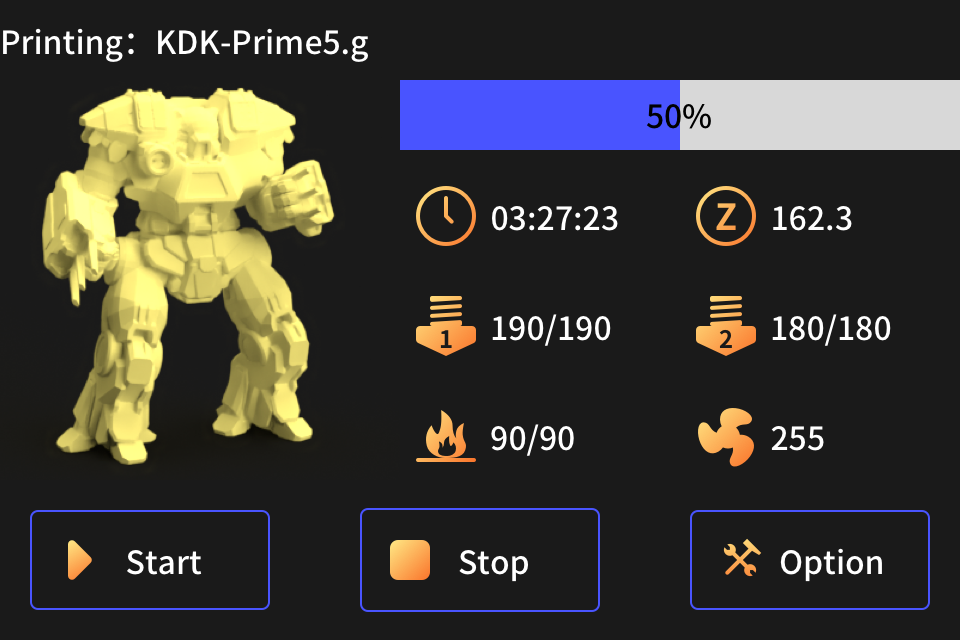

# Сборка Marlin с интерфейсом MKS UI



Начиная с версии 2.0.6 в Marlin был добавлен графический интерфейс от компании MKS. Отрисовка интерфейса использует библиотеку LVGL 6. MKS внесли небольшие изменения в ее код, поэтому при сборке она скачивается не с гитхаба LVGL, а с гитхаба MKS.

Данная инструкция описывает, как скомпилировать Marlin с этим интерфейсом на примере платы Robin Nano. На данный момент, актуальная версия 2.0.7.2

Данный графический интерфейс реализует внутри своего кода некоторые функции Marlin, а так же работу с wifi модулем. Поэтому собирать нужно на версии Marlin из [оффициального репозитория Marlin](https://github.com/MarlinFirmware/Marlin), а не из версии с поддержкой WIFI модуля.

В коде есть какая-то поддержка WIFI, но передача файлов на данный момент не работает.

## Конфигурация

Для сборки я использовал стабильную ветку 2.0.x

В качестве базовой конфигурации, чтобы не настраивать параметры которые относятся к "железу" принтера, я использовал конфигурацию (Configuration.h и Configuration_adv.h) из [моей сборки](https://github.com/Sergey1560/Marlin_FB4S), поэтому далее будут указаны параметры, которые нужно изменить относительно нее.

Для сборки по-умолчанию под плату robin_nano нужно в файле platformio.ini параметр default_envs установить в mks_robin_nano35.

### Configuration.h 

Нужно выбрать интерфейс:

```
//#define TFT_CLASSIC_UI
//#define TFT_COLOR_UI
#define TFT_LVGL_UI
```

Так же, чуть выше должен быть выбран тип экрана:

```
#define MKS_ROBIN_TFT35
```

Отключить выравнивание стола:

```
//#define LCD_BED_LEVELING
```

В качестве места хранения EEPROM выбрать SD:

```
#define EEPROM_SD
```

В моей конфигурации включен Bltouch и в настройках отдельно указан BL_TOUCH_Z_PIN. В конфигурации по-умолчанию, такого попределения нет, поэтому либо его нужно указать и настроить, либо вообще выключить Z Probe:

```
//#define Z_MIN_PROBE_PIN BL_TOUCH_Z_PIN // Pin 32 is the RAMPS default
//#define BLTOUCH
//#define Z_MIN_PROBE_REPEATABILITY_TEST

//#define AUTO_BED_LEVELING_3POINT
//#define AUTO_BED_LEVELING_LINEAR
//#define AUTO_BED_LEVELING_BILINEAR
//#define AUTO_BED_LEVELING_UBL
//#define MESH_BED_LEVELING

```

Внутри библиотеки LVGL свой драйвер touch-экрана, поэтому нужно выключить:

```
//#define TOUCH_SCREEN
```

### Configuration_adv.h

Отключить ADVANCED_PAUSE_FEATURE:

```
//#define ADVANCED_PAUSE_FEATURE
```

```
//#define ASSISTED_TRAMMING
```

В такой конфигурации прошивка компилируется, но остается меньше 4Кб памяти на стек:
```
RAM:   [========= ]  94.1% (used 61680 bytes from 65536 bytes)
```

Этого может хватить, а может и нет, определить это можно только экспериментально. Огромная часть памяти занята видеобуфером библиотеки LVGL. Его можно сделать чуть меньше, однако MKS почему-то определили его размер не в коде Marlin, а в коде самой библиотеки. Таким образом, при каких-то обновлениях, platformio просто заменит исправления новой версией. Кроме того, скачиваемоый код библиотеки находится не под контролем git. Поэтому, если наблюдается зависание МК при работе, возможно стоит уведичить количество свободной памяти, которая используется под стек. Можно или выключить еще какой-то функционал, или все же уменьшить размер видеобуфера.

В файле .pio/libdeps/mks_robin_nano35/lvgl/lv_conf.h (появится после первой сборки, когда platformio скачает библиотеку):

```
#  define LV_MEM_SIZE    (10U * 1024U)
```

В таком варианте остается около 9кб на стек, этого более чем достаточно.

### wathcdog fix

В Marlin 2.0.7.2 есть небольшая проблема, что во время загрузки картинок и шрифтов, которые нужны для работы с интерфейсом, не обновляется счетчик watchdog и МК считает, что он завис и перезагружается. В ближаших релизах это видимо будет исправлено, но как временная мера, просто выключить watchdog в Configuration_adv.h :

```
//#define USE_WATCHDOG
```

## Прошивка

Для загрузки прошивки нужно скопировать в корень SD карты файл Robin_nano35.bin и папку assets из .pio/build/mks_robin_nano35.
